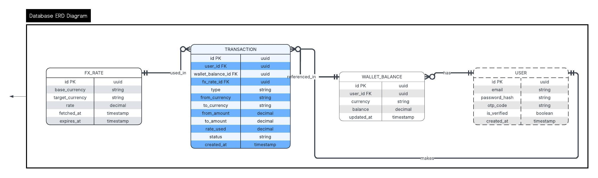
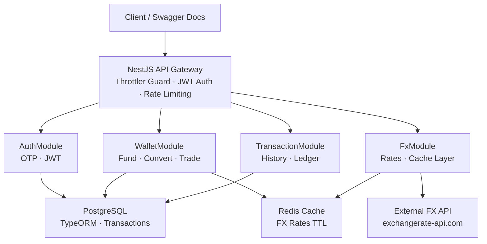
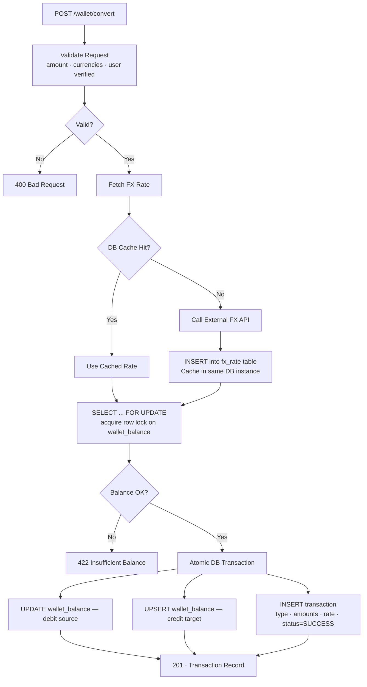

# FX Trading App — Backend API

A NestJS backend for a multi-currency FX trading platform. Users can register, fund wallets, and trade Naira (NGN) against international currencies (USD, EUR, GBP, etc.) using real-time exchange rates.

---

## Table of Contents

- [Setup Instructions](#setup-instructions)
- [Environment Variables](#environment-variables)
- [Key Assumptions](#key-assumptions)
- [Architectural Decisions](#architectural-decisions)
- [API Documentation](#api-documentation)
- [Database Schema](#database-schema)###
- [Testing](#testing)
- [Supported Currencies](#supported-currencies)
- [Scaling Considerations](#scaling-considerations)
- [Bonus: Architecture & Flow Diagrams](#bonus-architecture--flow-diagrams)
- [Potential Security Improvement](#potential-security-improvement)

---

## Setup Instructions

### Prerequisites

- Node.js v18+
- PostgreSQL 14+ (or MySQL 8+)
- Redis 6+
- A free API key from [exchangerate-api.com](https://www.exchangerate-api.com)
- A Gmail account (or any SMTP provider) for sending OTP emails

### 1. Clone the repository

```bash
git clone https://github.com/EfosaE/fx-trading-app.git
cd fx-trading-app
```

### 2. Install dependencies

```bash
npm install
```

### 3. Configure environment variables

```bash
cp .env.example .env
```

Fill in the values as described in the [Environment Variables](#environment-variables) section below.

### 4. Run Database Migrations

Ensure your PostgreSQL instance is running either local or cloud. A `compose.infra.yaml` file is included at the root of the project to spin one up:

```bash
docker compose -f compose.infra.yaml up -d
```

> [!NOTE]
> [DBeaver](https://dbeaver.io) was used as the database GUI during development. You can connect it to the local instance using the credentials defined in `compose.infra.yaml`.
> DB_PORT: 5433 was used as the database PORT during development because my machine has the 5432 taken by windows, if yours is free you can edit to use 5432.

Then run migrations:

```bash
npm run migration:run
```

### 5. Start the application

```bash
# Development
npm run start:dev

# Production
npm run build
npm run start:prod
```

The server starts on `http://localhost:3000` by default.

### 6. Access Swagger docs

```
http://localhost:3000/api/docs
```

---

## Environment Variables

```env
# App
PORT=3000
NODE_ENV=development

# Database (PostgreSQL)
DB_HOST=localhost
DB_PORT=5432
DB_USERNAME=postgres
DB_PASSWORD=your_password
DB_NAME=fx_trading

# Redis
REDIS_HOST=localhost
REDIS_PORT=6379

# JWT
JWT_SECRET=your_jwt_secret_here
JWT_EXPIRES_IN=7d

# FX Rate API
FX_API_KEY=your_exchangerate_api_key
FX_API_BASE_URL=https://v6.exchangerate-api.com/v6
FX_RATE_TTL_SECONDS=300

# Mail (Gmail SMTP, I used Mailtrap since it was for development purposes)
EMAIL_HOST=smtp.gmail.com
EMAIL_PORT=587
EMAIL_USER=your_email@gmail.com
EMAIL_PASS=your_app_password
EMAIL_FROM=FX Trading App <your_email@gmail.com>

# Wallet
INITIAL_WALLET_CURRENCY=NGN
```

---

## Key Assumptions

### User & Authentication

- Email and password are required for registration. Phone number is optional.
- OTP codes are 6-digit numeric strings, valid for 10 minutes.
- Only verified users can access wallet and trading features. Unverified users receive a `403 Forbidden` on protected routes.
- **Session Management:** JWT tokens are used for session management. Token expiry is hardcoded for assessment purposes — in production, this value would typically be stored in a `config.yaml` or `config.json` file as a configuration value

### Wallet & Balances

- Each user does **not** have a single wallet with currency columns. Instead, wallet balances are modelled as separate rows in a `wallet_balance` table with a `(user_id, currency)` unique constraint. This means adding support for a new currency requires zero schema changes.
- A user's balance for a given currency is created on first use (first fund or first conversion into that currency). Users start with no balance rows.
- Funding is only supported in NGN by default, but the `POST /wallet/fund` endpoint accepts a `currency` parameter to support multi-currency funding in future.
- All monetary values are stored as `DECIMAL(18, 6)` to handle precision across currencies with very different denominations (e.g. NGN vs JPY vs BTC).

### FX Rates & Trading

- FX rates are fetched from the external API (https://www.exchangerate-api.com) and stored in my postgres with an expiresAt column (default: 5 minutes). Redis was not used in this assessment case for simplicity as a DB helps with potential audit trails and it is fast enough.
- Every rate used in a transaction is persisted to the `fx_rate` table. This creates a permanent audit trail — each `transaction` row carries an `fx_rate_id` FK pointing to the exact rate that was applied.
- If the external FX API is unavailable, the system falls back to the most recently stored rate in the `fx_rate` table. If no rate exists at all, the trade request returns a `503 Service Unavailable` with a clear error message.
- No trading fees or spreads are applied. The raw mid-market rate is used. (A `fee_rate` column can be added to extend this.)
- "Convert" and "Trade" are treated as the same operation at the data level — both debit one currency balance and credit another. The `type` field on the transaction (`FUND`, `CONVERT`, `TRADE`) differentiates them in history.

### Concurrency & Safety

- Wallet balance updates use database-level row locking (`SELECT ... FOR UPDATE`) inside a transaction to prevent double-spending. Two concurrent trades on the same balance will serialise correctly. In TYPEORM, use pessimistic write locking (`pessimistic_write`)
- All balance-modifying operations are wrapped in a single atomic DB transaction: debit source balance → credit target balance → insert transaction record. If any step fails, the entire operation rolls back.
- Transaction records are append-only. Once created, a transaction row is never updated or deleted (except for status: `PENDING` → `SUCCESS` or `FAILED`).

---

## Architectural Decisions

### Multi-currency wallet design

Rather than adding a column per currency on the user table, wallet balances are stored as rows in a dedicated `wallet_balance` table. A composite unique index on `(user_id, currency)` enforces one balance row per currency per user. This is the standard approach in financial systems because it scales to any number of currencies without schema migrations.

### Single-layer rate caching (No Redis, Just PostgreSQL)

Due to assessment time constraints and other reponsibilites,
FX rates are served from DB as cache on hit (typically < 5ms) so it was actually fast enough. On cache miss, the rate is fetched from the external API, written to PostgreSQL for audit purposes, and then stored in DB as cache with an expiresAt column. PostgreSQL is the source of truth and also the cache, in real systems Redis will be used.

### Atomic transactions with row-level locking

Every trade operation acquires a `SELECT ... FOR UPDATE` lock on the affected `wallet_balance` rows before reading or writing balances. This prevents race conditions where two concurrent requests could both read a sufficient balance and both proceed, resulting in a negative balance.

### Event-Driven Architecture

Rather than coupling side effects directly to business logic, NestJS `EventEmitter2` is used to emit and handle domain events — for example, dispatching an OTP email after a user registers without blocking the registration response.

In a production system, this would typically be replaced with a dedicated message broker — Redis Streams for lightweight setups or Kafka for high-throughput, fault-tolerant event pipelines.

### NestJS modular structure

The application is split into four feature modules: `AuthModule`, `WalletModule`, `FxModule`, and `TransactionModule`. Each module owns its own controller, service, and repository. Cross-module communication goes through service injection, not direct repository access from other modules.

### TypeORM with repository pattern

TypeORM repositories are injected into services via `@InjectRepository()`. Raw query builder is used only where atomic operations require it (e.g. locking). All entities use UUID primary keys to avoid enumerable IDs in API responses. The major reason TypeORM works so well with NestJS.

### Error handling

- External API failures are caught and trigger the DB fallback rate strategy.
- All inputs are validated with `class-validator` DTOs at the controller layer.
- Insufficient balance returns `422 Unprocessable Entity` (not `400`) to distinguish a valid but unfulfilable request from a malformed one.
- Global exception filters ensure all errors return a consistent `{ statusCode, message, timestamp }` shape.

---

## API Documentation

A full Swagger UI is available at `/api/v1/docs` when the server is running.

### Base URL

```
http://localhost:3000
```

## API Response Format

All API responses follow a consistent shape:

```json
{
  "success": true | false,
  "message": "string",
  "data": "<T> | null",
  "error": {
    "code": "string",
    "details": "unknown (optional)"
  },
  "meta": "Record<string, unknown> (optional)"
}
```

- **`success`** — Indicates whether the request was successful.
- **`message`** — A human-readable message, it can also contain instructions in event of a queued request.
- **`data`** — The response payload, typed generically as `T`. `null` on failure.
- **`error`** — Present on failure. Contains a `code` and optional `details`.
- **`meta`** — Optional metadata (e.g., pagination info).

> [!NOTE]
> Errors throw an `ApiRequestError` with a `statusCode`, `code`, and optional `details` for structured error handling.

### Authentication

All routes except `POST /auth/register`, `POST /auth/verify`and `POST /auth/login` require a Bearer token in the `Authorization` header:

```
Authorization: Bearer <jwt_token>
```

---

### Auth

#### `POST /auth/register`

Register a new user. Sends a 6-digit OTP to the provided email.

**Request body:**

```json
{
  "firstName": "string",
  "lastName": "string",
  "email": "user@example.com",
  "password": "stringst"
}
```

**Response `201`:**

```json
{
  "message": "Registration successful. Check your email for the OTP."
}
```

---

#### `POST /auth/verify`

Verify OTP and activate the account. Returns a JWT token on success.

**Request body:**

```json
{
  "email": "user@example.com",
  "otpCode": "482910"
}
```

**Response `200`:**

```json
{
  "accessToken": "eyJhbGciOiJIUzI1NiIsInR5cCI6IkpXVCJ9..."
}
```

---

#### `POST /auth/login`

Login with email and password. Returns a JWT token.

**Request body:**

```json
{
  "email": "user@example.com",
  "password": "StrongPass123!"
}
```

**Response `200`:**

```json
{
  "accessToken": "eyJhbGciOiJIUzI1NiIsInR5cCI6IkpXVCJ9..."
}
```

---

### Wallet

#### `GET /wallet`

Get all currency balances for the authenticated user.

**Response `200`:**

```json
{
  "balances": [
    { "currency": "NGN", "balance": "45000.000000" },
    { "currency": "USD", "balance": "27.430000" }
  ]
}
```

---

#### `POST /wallet/fund`

Fund the wallet in a given currency.

**Request body:**

```json
{
  "currency": "NGN",
  "amount": 50000
}
```

**Response `201`:**

```json
{
  "message": "Wallet funded successfully.",
  "transaction_id": "uuid",
  "new_balance": "95000.000000"
}
```

---

#### `POST /wallet/convert`

Convert between two currencies using the real-time FX rate.

**Request body:**

```json
{
  "fromCurrency": "NGN",
  "toCurrency": "USD",
  "amount": 10000
}
```

**Response `201`:**

```json
{
  "transactionId": "uuid",
  "fromCurrency": "NGN",
  "toCurrency": "USD",
  "amountDebited": "10000.000000",
  "amountCredited": "6.060000",
  "rateUsed": "1650.000000",
  "status": "SUCCESS"
}
```

**Error `422`** (insufficient balance):

```json
{
  "statusCode": 422,
  "message": "Insufficient NGN balance. Available: 5000.00, required: 10000.00"
}
```

---

#### `POST /wallet/trade`

Trade Naira against a foreign currency or vice versa. Functionally equivalent to `/wallet/convert` but logs `type: TRADE` in transaction history.

**Request body:**

```json
{
  "fromCurrency": "EUR",
  "toCurrency": "NGN",
  "amount": 50
}
```

**Response `201`:** Same shape as `/wallet/convert`.

---

### FX Rates

#### `GET /fx/rates`

Get current FX rates for all supported currency pairs (base: NGN).

**Response `200`:**

```json
{
  "base": "NGN",
  "rates": {
    "USD": 0.000606,
    "EUR": 0.000556,
    "GBP": 0.000476,
    "GBP": 0.000476
  },
  "fetchedAt": "2024-03-16T10:04:00.000Z"
}
```

---

### Transactions

#### `GET /transactions`

Get the authenticated user's full transaction history.

**Query parameters:**
| Parameter | Type | Description |
|-----------|------|-------------|
| `page` | number | Page number (default: 1) |
| `limit` | number | Items per page (default: 20, max: 100) |
| `type` | string | Filter by type: `FUND`, `CONVERT`, `TRADE` |
| `status` | string | Filter by status: `SUCCESS`, `FAILED`, `PENDING` |

**Response `200`:**

```json
{
  "data": [
    {
      "id": "uuid",
      "type": "CONVERT",
      "from_currency": "NGN",
      "to_currency": "USD",
      "from_amount": "10000.000000",
      "to_amount": "6.060000",
      "rate_used": "1650.000000",
      "status": "SUCCESS",
      "created_at": "2024-03-16T10:04:22.000Z"
    }
  ],
  "total": 42,
  "page": 1,
  "limit": 20
}
```

---

## Database Schema

```
USER
  id            UUID PK
  email         VARCHAR UNIQUE NOT NULL
  password_hash VARCHAR NOT NULL
  otp_code      VARCHAR
  is_verified   BOOLEAN DEFAULT false
  created_at    TIMESTAMP

WALLET_BALANCE
  id         UUID PK
  user_id    UUID FK → USER.id
  currency   VARCHAR(10) NOT NULL
  balance    DECIMAL(18,6) DEFAULT 0
  updated_at TIMESTAMP
  UNIQUE(user_id, currency)

FX_RATE
  id              UUID PK
  base_currency   VARCHAR(10)
  target_currency VARCHAR(10)
  rate            DECIMAL(18,6)
  fetched_at      TIMESTAMP
  expires_at      TIMESTAMP

TRANSACTION
  id               UUID PK
  user_id          UUID FK → USER.id
  fx_rate_id       UUID FK → FX_RATE.id (nullable for FUND)
  type             ENUM(FUND, CONVERT, TRADE)
  from_currency    VARCHAR(10)
  to_currency      VARCHAR(10)
  from_amount      DECIMAL(18,6)
  to_amount        DECIMAL(18,6)
  rate_used        DECIMAL(18,6)
  status           ENUM(PENDING, SUCCESS, FAILED)
  created_at       TIMESTAMP
```

**Relationships:**

- One `USER` has many `WALLET_BALANCE` rows (one per currency held)
- One `USER` has many `TRANSACTION` rows
- One `WALLET_BALANCE` is referenced in many `TRANSACTION` rows
- One `FX_RATE` is used in many `TRANSACTION` rows

---

## Testing

The test suite covers the three most critical areas called out in the assessment: wallet balance logic, currency conversion, and transaction integrity.

### Running the tests

```bash
# All unit tests
npm run test

# Integration / e2e tests (requires a running PostgreSQL + Redis instance)
npm run test:e2e

# Coverage report
npm run test:cov
```

---

### Unit Tests

Unit tests mock all external dependencies (database, Redis, FX API) and test service logic in isolation.

#### Wallet service — balance debit/credit

```bash
npx jest wallet.service.spec.ts
```

#### FX service — db as cache and fallback behaviour

```bash
npx jest src/fx/fx.service.spec.ts
```

#### Auth service — OTP verification

```bash
npx jest auth.service.spec.ts
```

---

### Integration Tests

Integration tests spin up a real NestJS application against a test PostgreSQL database and in-memory Redis. Each test suite resets the database state before running.

#### Wallet conversion — end to end

```bash
npx jest test/wallet.e2e-spec.ts
```

#### Concurrency — race condition test

```bash
npx jest test/wallet-concurrency.e2e-spec.ts
```

---

### Test Coverage Summary

| Area             | Type        | What is tested                                                      |
| ---------------- | ----------- | ------------------------------------------------------------------- |
| Wallet fund      | Unit        | New row creation, top-up of existing balance                        |
| Wallet convert   | Unit        | Correct debit/credit math, insufficient balance                     |
| Wallet convert   | Integration | Full DB state after conversion, transaction record created          |
| Concurrency      | Integration | Two simultaneous trades cannot double-spend                         |
| FX rate cache    | Unit        | Redis hit skips API, miss fetches and persists                      |
| FX rate fallback | Unit        | Stale DB rate used when API is down, 503 when no rate exists        |
| OTP verify       | Unit        | Valid OTP activates user, expired OTP rejected, wrong OTP rejected  |
| Auth guard       | Integration | Protected routes return 401 without token, 403 for unverified users |

---

## Supported Currencies

| Code | Currency       |
| ---- | -------------- |
| NGN  | Nigerian Naira |
| USD  | US Dollar      |
| EUR  | Euro           |

> [!NOTE]
> Additional currencies can be supported by updating the `Currency` enum. No schema changes are required. In a production system, currencies would typically be managed via a `currencies` database table, but an enum was used here for simplicity.

---

## Scaling Considerations

- **Rate caching:** Redis TTL keeps external API & DB calls minimal. A `@Cron` job can pre-warm the cache for all supported pairs on a schedule.
- **Database:** The `wallet_balance` and `transaction` tables are the hot paths. Index on `(user_id, currency)` for balance lookups and `(user_id, created_at DESC)` for transaction history pagination.
- **Horizontal scaling:** The app is stateless (JWT auth, Redis for shared cache). Multiple instances can run behind a load balancer without session affinity.
- **Queue:** For very high throughput, trade requests can be enqueued (e.g. BullMQ + Redis) and processed asynchronously, with webhooks or polling for status updates.

---

## Bonus: Architecture & Flow Diagrams

### Entity Relationship Diagram (ERD)

Shows all four database tables, their fields, primary/foreign keys, and the relationships between them. The key design decision visible here is that `WALLET_BALANCE` uses a `(user_id, currency)` composite unique constraint rather than per-currency columns on the `USER` table — making the schema extensible to any number of currencies without migrations.



| Table            | Role                                                  |
| ---------------- | ----------------------------------------------------- |
| `USER`           | Identity and authentication                           |
| `WALLET_BALANCE` | One row per currency held per user                    |
| `TRANSACTION`    | Immutable ledger — every fund, convert, and trade     |
| `FX_RATE`        | Audit log of every rate fetched from the external API |

---

### System Architecture



---

### Currency Conversion & Trade Flow

The complete path of a `POST /wallet/convert` or `POST /wallet/trade` request:



> [!NOTE]
> Redis was not implemented for this assessment — FX rate caching is handled using the same PostgreSQL instance via the `fx_rate` table.

**Key safety properties:**

- The `SELECT ... FOR UPDATE` lock on step 4 ensures two concurrent trades on the same balance serialise correctly — preventing double-spending.
- The entire debit + credit + log operation is a single atomic DB transaction. A failure at any step rolls the whole thing back — no partial state is ever committed.
- The `fx_rate_id` FK on every transaction row creates a permanent, queryable audit trail of exactly which rate was applied to every trade.

---

> [!NOTE]
> Important: TypeORM returns decimal columns as strings. A library like decimal.js for arithmetic to avoid floating-point errors.

## Potential Security Improvement

Limit OTP attempts — a common requirement in fintech applications. This can be implemented by adding the following fields to the `User` entity:

```typescript
@Column({ name: 'otp_attempts', default: 0 })
otpAttempts: number;
```

Then in the OTP verification logic:

- Increment `otpAttempts` on each failed attempt
- Lock the account after 5 consecutive failures
